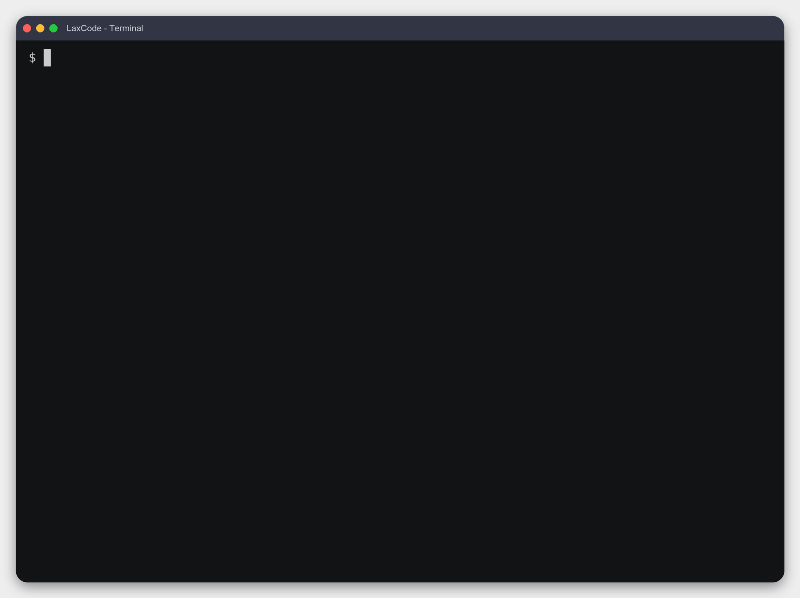

<div align="right">

**中文** | [English](./README_EN.md)

</div>

# LaxCode

[](https://github.com/mikellxy/laxcode-cli/actions/workflows/test.yml)

LaxCode 是一个用 Go 实现的轻量 AI Agent。

## 快速开始
### coding agent cli
> [!TIP]
> 默认挂载工具：`grep` `glob` `read_file` `write_file` `edit_file` `bash` `read_artifact`

```shell
export OPENAI_API_KEY=sk-xxxxxxxxxxxxxxxx
export OPENAI_BASE_URL=https://api.openai.com/v1     # 任意 OpenAI 兼容端点
export OPENAI_MODEL=gpt-4o-mini

make build
./bin/laxcode
```
  

### see agentic 问答(支持 RAG 用户记忆召回)
> [!TIP]
> - 默认不挂载工具
> - 异步从每三轮 ReAct 循环提取用户记忆，进行 chunk-vectorization 持久化
> - 用户 query 向量化召回记忆
> - 使用指定的 sqlite-vec db

```shell
# 指定向量化模型 & 初始化 chunk-vectorization python pipeline
export OPENAI_EMBEDDING_API_KEY=sk-xxxxxxxxxxxxxxxx
export OPENAI_EMBEDDING_BASE_URL=https://api.openai.com/v1 # 任意 OpenAI 兼容端点
export OPENAI_EMBEDDING_MODEL_NAME=text-embedding-3-small
uv sync --project knowledge-pipeline --locked
export USER_MEMORY_EXECUTABLE="$PWD/knowledge-pipeline/.venv/bin/laxcode-knowledge"
# 非必须，可以正常启动sse服务进行问答，并跳过用户记忆提取和召回
```
```shell
export OPENAI_API_KEY=sk-xxxxxxxxxxxxxxxx
export OPENAI_BASE_URL=https://api.openai.com/v1     # 任意 OpenAI 兼容端点
export OPENAI_MODEL_NAME=gpt-4o-mini

make build
# 激活记忆功能时
# -vector-dim 根据使用的向量化模型设置
# -kb 设置 sqlite-vec db 绝对路径
mkdir -p /tmp/laxcode-example
./bin/laxcode -sse \
  -kb=/tmp/laxcode-example/kb.sqlite \
  -vector-dim=1024 \
  -workdir=/tmp/laxcode-example \
  -addr=127.0.0.1:8080
```
```shell
# 另开一个终端，启动 React 前端（http://127.0.0.1:5173）
pnpm --dir web install --frozen-lockfile
pnpm --dir web dev

# 或使用 npm
npm --prefix web install
npm --prefix web run dev
```

### agentic RAG 问答
> [!TIP]
> - 默认不挂载工具
> - step-1: 使用项目的 knowledge-pipeline 工具进行知识文档 chunk-vectorization，并持久化到指定的 sqlite-vec db
> - step-2: 启动 laxcode agentic RAG QA，体验 RAG 知识库

```shell
# 配置知识库使用的向量化模型
export OPENAI_EMBEDDING_API_KEY=sk-xxxxxxxxxxxxxxxx
export OPENAI_EMBEDDING_BASE_URL=https://api.openai.com/v1 # 任意 OpenAI 兼容端点
export OPENAI_EMBEDDING_MODEL_NAME=text-embedding-3-small

# 安装 Python pipeline，并将知识文档写入指定的 sqlite-vec db
uv sync --project knowledge-pipeline --locked
mkdir -p /tmp/laxcode-qa
"$PWD/knowledge-pipeline/.venv/bin/laxcode-knowledge" \
  --target=knowledge \
  --doc=/absolute/path/to/knowledge.md \
  --db=/tmp/laxcode-qa/kb.sqlite
```
```shell
# QA 查询必须使用与建库相同的向量化模型
export OPENAI_EMBEDDING_API_KEY=sk-xxxxxxxxxxxxxxxx
export OPENAI_EMBEDDING_BASE_URL=https://api.openai.com/v1 # 任意 OpenAI 兼容端点
export OPENAI_EMBEDDING_MODEL_NAME=text-embedding-3-small

export OPENAI_API_KEY=sk-xxxxxxxxxxxxxxxx
export OPENAI_BASE_URL=https://api.openai.com/v1     # 任意 OpenAI 兼容端点
export OPENAI_MODEL_NAME=gpt-4o-mini

make build
mkdir -p /tmp/laxcode-qa/workdir
./bin/laxcode -sse \
  -qa \
  -kb=/tmp/laxcode-qa/kb.sqlite \
  -workdir=/tmp/laxcode-qa/workdir \
  -addr=127.0.0.1:8080
```
