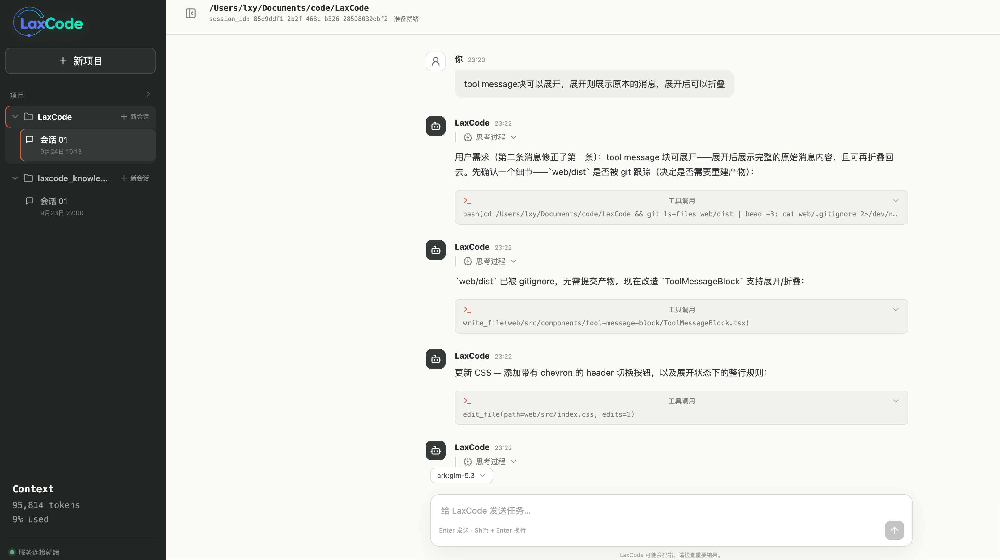
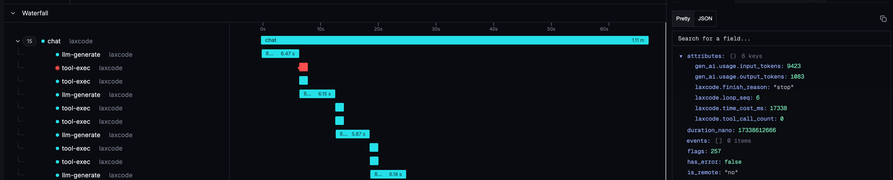

<div align="right">

**中文** | [English](./README_EN.md)

</div>

<p align="center">
  <span style="font-family: 'Arial Rounded MT Bold', 'Nunito', sans-serif; font-size: 24px; font-weight: 700; color: #8798E5;">Lax</span><span style="font-family: 'Arial Rounded MT Bold', 'Nunito', sans-serif; font-size: 24px; font-weight: 700; color: #58D2C2;">Code</span>
</p>

[](https://github.com/mikellxy/laxcode-cli/actions/workflows/test.yml)

LaxCode 是一个用 Go 实现、通过 Web UI 使用的轻量 coding agent。需要 Go 版本 >= 1.26。
## 快速开始
```shell
git clone https://github.com/mikellxy/laxcode.git && cd laxcode
brew install pnpm
./web.sh
```
该命令默认会在 http://127.0.0.1:5173 启动 Web UI, 本机启动时还会用默认浏览器打开页面。 [Windows使用](./docs/windows_run_web.md)
  
  
  
支持上报 trace 至 OTel 服务  
  


## 特性
- 会话存储引擎
  - SQLite 事务 + 乐观锁、上下文压缩in_memory消息分代原子化更新、崩溃恢复时进行 agent 循环完整性检测。 [设计文档](./docs/session-storage-engine.md)
- 效果评测
  - 提供 agent 循环效果评测配套工具，多维打分，输出人类可读报告。 [查看单任务评估样例](./docs/readpaged-maxbytes-fix-evaluation.md)
- 上下文压缩
  - 剪枝、上下文卸载、LLM 结构化摘要三层压缩。 [设计文档](./docs/context-compaction-design.md)
- 软沙箱防护 & 危险命令 human-in-the-loop 确认
- 可观测性
  - 上报 agent 循环 span 到您的 Otel 服务(SigNoz/Tempo/Jaeger...)。 [将 LaxCode Span 上报到 SigNoz](./docs/signoz-tracing.md)

## 功能导航

- [**Coding Agent Web**](#coding-agent-web)
- [**Agent 效果评估**](#agent-session-evaluation) — 基于完整 ReAct 日志评估一次任务的完成效果(LLM-as-a-Judge)
- [**架构**](#architecture) 

### 创建配置文件

[配置文件使用说明](./docs/settings.md)。

<a id="coding-agent-web"></a>

### Coding Agent Web
> [!TIP]
> 默认挂载工具：`grep` `glob` `read_file` `write_file` `edit_file` `bash` `read_artifact`

在 macOS 上启动 Web UI：

```shell
brew install pnpm
./web.sh
```

`web.sh` 会安装前端依赖、构建 Go 程序，以随机本地端口启动 coding 后端，再启动固定于 `127.0.0.1:5173` 的 Vite 页面。只有前后端均通过健康检查后才会打开默认浏览器；按 `Ctrl-C` 可同时停止两个服务。

Windows PowerShell 直接运行启动脚本：

```powershell
.\web.ps1
```

仓库中的 `bin/win/laxcode.exe` 与 `bin/win/laxcode-web.exe` 是预编译的 Windows x64 程序，后者已嵌入前端生产资源并反向代理到后端的随机端口。因此 Windows 用户无需安装 Go、Node.js、pnpm 或 GCC。脚本会在两个服务均就绪后打开默认浏览器，并在 `Ctrl-C` 后清理两个进程。

维护者更新 Windows 产物时，可在 macOS 安装 Go 和 `pnpm` 后执行 `make build-windows`。该目标会重新构建前端，并覆盖 `bin/win/` 中的两个 x64 程序。

手动启动时仍可使用 `./bin/laxcode -token-budget=100000`。新建会话时由页面传入工作目录，并与 `session_id`、`mode` 持久绑定。预算按当前 SSE 服务进程中的 `session_id` 连续计算，服务重启后重新建立基线。达到阈值或遇到危险 Bash 命令时，页面会暂停当前流并显示确认框。

后端默认启动 coding SSE 服务，仅保留 `-addr`、`-plan`、`-token-budget` 启动参数。原 `-sse`、`-mode`、`-kb`、`-session` 参数已移除；会话通过 Web UI 创建和续接。已有 code 会话仍可使用，旧 RAG 会话不能作为 coding 会话续接；已有数据库中的遗留记忆表保留原数据。

<a id="agent-session-evaluation"></a>

### 评估 Coding Agent 任务

当您使用 LaxCode 完成一个任务后，可以在会话页面右上角点击“评估”，输入本次评估的 requirement。Web 后端会为原会话创建快照，并以独立的 LLM-as-a-Judge 会话异步评估任务完成效果。

```text
${workdir}/eval/${session_id}/history.jsonl
```

评估任务以 `queued`、`running`、`succeeded`、`failed` 状态保存在 SQLite 中，页面会自动轮询。完成后的 Markdown 报告写入 `${HOME}/.laxcode/eval/`，任务列表会显示 requirement、状态和报告文件路径。

评估过程不会续聊或修改被评估任务的 session；评估器使用 `eval_${session_id}_${date_time}` 独立 session 保存自己的消息和 token 统计。

<a id="architecture"></a>

### 架构

Go 后端按 DDD 分层组织，核心依赖方向为 `cmd → application → domain ← infrastructure`；Web 前端作为独立子工程。

```text
LaxCode/
├── cmd/                            # 程序入口与运行模式适配
│   ├── main/                       # 加载配置并启动 coding Web 后端
│   ├── agentasm/                   # 组合根：装配 Agent、工具、模型、会话与追踪
│   ├── run_sse/                    # Web 后端：SSE、异步评估、会话、审批与目录选择接口
│   └── web/                        # 内嵌前端资源及反向代理的独立 Web 程序
├── internal/
│   ├── application/                # 应用层：编排领域能力与完整用例
│   │   ├── reactservice/           # ReAct 推理循环、上下文压缩与子 Agent 调度
│   │   └── llm_router/             # 本地模型网关的 HTTP/SSE 编排
│   ├── domain/                     # 领域层：核心模型、规则与基础设施端口
│   │   ├── session/                # 会话聚合、请求上下文及仓储接口
│   │   ├── tools/                  # 工具注册表、内置工具行为与执行端口
│   │   ├── prompt/                 # 系统提示词、Skill 与 Plan Mode 组装
│   │   ├── compactor/              # 上下文压缩策略
│   │   ├── llmprovider/            # LLM 客户端接口
│   │   ├── llmrouter/              # 模型网关流式传输接口
│   │   ├── telemetry/              # Trace 名称、属性与观测语义
│   │   └── sharedkernel/           # 消息、工具、SSE 与 token 等共享类型
│   └── infrastructure/             # 基础设施层：领域端口的外部实现
│       ├── llmprovider/             # OpenAI Responses 协议适配
│       ├── llmrouter/               # OpenAI 兼容流式网关适配
│       ├── sessionrepo/             # SQLite 会话、历史与评估任务仓储
│       ├── artifactstore/           # 会话产物的文件存储
│       ├── workfs/                  # 工作区文件读写实现
│       ├── shell/                   # Shell 执行、超时与进程管理
│       ├── ripgrep/                 # 文件搜索与内容检索适配
│       ├── skillrepo/               # 本地 Skill 扫描与加载
│       ├── skillstore/              # 全局 Skill 包的受限暂存与原子提交
│       ├── config/                  # 配置加载与模型目录
│       ├── layout/                  # 用户数据与会话磁盘布局
│       └── tracing/                 # OpenTelemetry、OTLP 与本地追踪实现
├── web/                             # React + TypeScript Web 客户端
│   └── src/
│       ├── api/                     # 后端接口与 SSE 客户端
│       ├── app/                     # 应用根组件与全局 Provider
│       ├── components/              # 聊天、模型选择等界面组件
│       ├── features/                # 聊天状态与身份等业务模块
│       ├── hooks/                   # 工作区等可复用 React Hooks
│       └── types/                   # 前端 API 与消息类型
```
